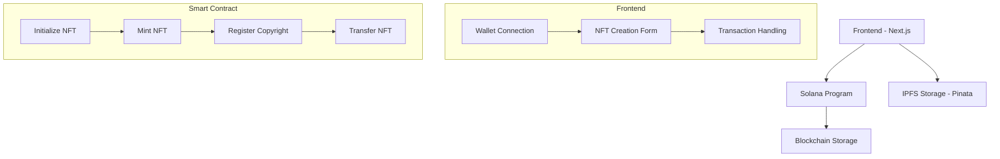

# Music NFT Platform

A decentralized platform for creating and managing music NFTs on the Solana blockchain. This platform enables artists to mint NFTs for their music, register copyrights, and manage ownership.

## Architecture Overview



## Technical Stack

- **Frontend**: Next.js, TypeScript, TailwindCSS
- **Blockchain**: Solana (Program written in Rust)
- **Storage**: IPFS via Pinata
- **Wallet**: Phantom Wallet Integration

## Core Features

1. **NFT Creation**
   - Upload music files to IPFS
   - Create metadata with artist and title information
   - Initialize NFT account on Solana

2. **NFT Minting**
   - Convert initialized NFT to official token
   - Register on Solana blockchain
   - Link with IPFS content

3. **Copyright Registration**
   - Register copyright information
   - Store certificate hash on IPFS
   - Link copyright data with NFT

4. **Ownership Transfer**
   - Secure transfer mechanism
   - Ownership verification
   - Transfer history tracking

## Smart Contract Structure

The Solana program handles four main instructions:

1. `InitializeMusicNFT`: Creates new NFT with metadata
2. `MintNFT`: Mints the initialized NFT
3. `RegisterCopyright`: Registers copyright information
4. `TransferNFT`: Transfers ownership to new wallet

## Data Flow

1. **NFT Creation Flow**
```mermaid
mermaid
sequenceDiagram
Actor Artist
Artist->>Frontend: Upload Music & Certificate
Frontend->>Pinata: Store Files
Pinata-->>Frontend: Return IPFS Hashes
Frontend->>Solana: Initialize NFT
Solana-->>Frontend: Confirm Transaction
Frontend-->>Artist: Success Notification
```

## Setup Instructions

1. **Prerequisites**
   ```bash
   # Install Solana CLI tools
   sh -c "$(curl -sSfL https://release.solana.com/v1.17.0/install)"
   
   # Install dependencies
   cd app
   bun install
   ```

2. **Smart Contract Deployment**
   ```bash
   cd program
   cargo build-bpf
   solana program deploy target/deploy/music_nft_program.so
   ```

3. **Frontend Development**
   ```bash
   cd app
   bun run dev
   ```

## Environment Configuration

Create a `.env.local` file in the `app` directory:
```env
NEXT_PUBLIC_PINATA_API_KEY=your_pinata_api_key
NEXT_PUBLIC_PINATA_SECRET_KEY=your_pinata_secret_key
```
## Code References

### Smart Contract
- Main Program Logic: 
```rust
pub fn process_instruction(
    program_id: &Pubkey,
    accounts: &[AccountInfo],
    instruction_data: &[u8],
) -> ProgramResult {
    let instruction = MusicNFTInstruction::try_from_slice(instruction_data)
        .map_err(|_| ProgramError::InvalidInstructionData)?;

    match instruction {
        MusicNFTInstruction::InitializeMusicNFT { 
            title, 
            artist, 
            ipfs_hash, 
            certificate_hash 
        } => {
            initialize_music_nft(
                program_id,
                accounts,
                title,
                artist,
                ipfs_hash,
                certificate_hash,
            )
        }
        MusicNFTInstruction::MintNFT { nft_account_bump } => {
            mint_nft(program_id, accounts, nft_account_bump)
        }
        MusicNFTInstruction::RegisterCopyright { nft_account_bump } => {
            register_copyright(program_id, accounts, nft_account_bump)
        }
        MusicNFTInstruction::TransferNFT { new_owner } => {
            transfer_nft(program_id, accounts, new_owner)
        }
    }
}
```
### Frontend Components
- NFT Creation Form: 
```typescript
export function NFTForm() {
  const { publicKey, signTransaction } = useWallet();
  const [title, setTitle] = useState('');
  const [artist, setArtist] = useState('');
  const [musicFile, setMusicFile] = useState<File | null>(null);
  const [certificateFile, setCertificateFile] = useState<File | null>(null);
  const [loading, setLoading] = useState(false);
  const [nftAccount, setNftAccount] = useState<Keypair | null>(null);

  const handleCreateNFT = async () => {
    if (!publicKey || !signTransaction || !musicFile || !certificateFile) return;

    try {
      setLoading(true);
      const musicHash = await uploadToPinata(musicFile);
      const certificateHash = await uploadToPinata(certificateFile);

      const client = new MusicNFTClient(connection);
      const newNFTAccount = await client.createNFTAccount();
      setNftAccount(newNFTAccount);

      const instruction = await client.initializeMusicNFT(
        publicKey,
        newNFTAccount.publicKey,
        title,
        artist,
        musicHash,
        certificateHash
      );

      const transaction = new Transaction();
      transaction.add(instruction);
      
      transaction.recentBlockhash = (
        await connection.getRecentBlockhash('confirmed')
      ).blockhash;
      
      transaction.feePayer = publicKey;
      transaction.sign(newNFTAccount);

      const signedTx = await signTransaction(transaction);
      const txId = await connection.sendRawTransaction(signedTx.serialize());
      await connection.confirmTransaction(txId, 'confirmed');

      alert('NFT created successfully!');
    } catch (error) {
      console.error('Error creating NFT:', error);
      alert('Error creating NFT. Check console for details.');
    } finally {
      setLoading(false);
    }
  };
```
## Security Considerations

1. **Smart Contract Security**
   - Signer verification for all transactions
   - State validation to prevent double minting
   - Ownership verification for transfers

2. **Frontend Security**
   - Secure wallet connection handling
   - Transaction confirmation checks
   - Error handling and user feedback

## Testing

1. Local Development:
   ```bash
   # Start local Solana validator
   solana-test-validator
   
   # Run frontend
   cd app
   bun run dev
   ```

2. Smart Contract Testing:
   ```bash
   cd program
   cargo test
   ```

## Contributing

1. Fork the repository
2. Create feature branch
3. Commit changes
4. Open pull request

## License

This project is licensed under the MIT License.